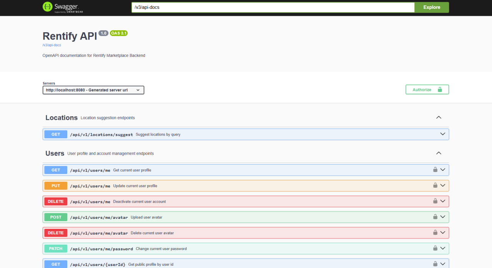

## Rentify Backend

Rentify Backend is a production‑ready, scalable REST API for a modern rental marketplace. It powers property listings, search, booking flows, payments, reviews, and real‑time conversations between guests and hosts. The service is built on Spring Boot with a strong focus on clean architecture, security, and predictable domain behavior.

### Overview

Rentify provides the backend for a full‑featured property rental platform. It exposes versioned JSON APIs for:

- Public property discovery and search
- Secure authentication and user management
- Host‑side listing management, availability, and pricing
- Booking lifecycle (request, confirm, cancel)
- Payments and wallet operations
- Favorites, reviews, and conversations between users

The API is documented with OpenAPI/Swagger and is designed to be consumed by web and mobile frontends.

### Technologies

The backend is implemented using a robust, maintainable stack:

- **Language**: Java 17
- **Framework**: Spring Boot 3 (Web, Security, Validation)
- **Persistence**: Spring Data JPA
- **Database**: PostgreSQL
- **Authentication**: JWT‑based auth with optional cookie or bearer strategies, Google OAuth integration
- **Object Mapping**: MapStruct
- **Build Tool**: Maven
- **Cloud Storage**: Cloudinary for property photos
- **API Documentation**: springdoc‑openapi (Swagger UI)
- **Testing**: JUnit 5, Spring Boot Test, Testcontainers (PostgreSQL)

### Performance & Security

Rentify Backend is designed with secure defaults and good runtime characteristics:

- **JWT security**: Configurable expiration and secret key via environment variables
- **OAuth 2.0**: Google sign‑in for simplified onboarding
- **Cookie or bearer strategy**: Configurable auth strategy (HTTP‑only cookies or `Authorization` header)
- **CORS configuration**: Restricts allowed origins and supports modern SPAs
- **Database access**: JPA with lazy loading controls and `open-in-view=false` to avoid N+1 in web layer
- **HTTP caching**: Long‑lived cache headers for static resources
- **Input validation**: Bean Validation (Jakarta) for DTOs on all major endpoints
- **Typed DTOs and mappers**: Clear separation between persistence models and external contracts

### Core Features

#### Authentication & Users

- **Email/password registration and login** with JWT tokens
- **Google OAuth login** using ID tokens
- **Configurable auth strategy**: bearer tokens or secure cookies
- **Logout** that clears auth cookie in cookie mode
- **User profile** endpoints for querying and updating account data (email, name, etc.)

#### Properties & Search

- **Public listings** with pagination and sorting
- **Host‑owned listings**: each user can manage their own properties
- **CRUD operations** on properties for authenticated hosts
- **Search API** with rich filters (location, price, dates, amenities, etc.) and pageable responses
- **Map pins endpoint** for efficient map rendering of property coordinates
- **Status management**: property lifecycle states (e.g. DRAFT, ACTIVE, INACTIVE, BLOCKED)

#### Availability & Calendar

- **Manual availability blocks** for hosts to close out specific dates
- **Merged availability** from both bookings and manual blocks
- **Unavailable date ranges API** for building booking calendars in the frontend

#### Photos & Media

- **Photo upload API** for properties using multipart form data
- **Cloudinary integration** for image storage, optimization, and CDN delivery
- **Photo deletion** with proper ownership checks

#### Bookings & Payments

- **Booking creation and management** for guests
- **Availability validation** before confirming bookings
- **Payments and wallet operations** (deposits, charges, payouts) exposed via dedicated controllers
- **Promotions and discounts** support through promotion APIs

#### Favorites, Reviews & Conversations

- **Favorites API** so users can bookmark properties
- **Reviews API** for guests to leave structured feedback for stays
- **Conversations/Chats** between hosts and guests for a booking or listing
- **Location directory and amenities** APIs to power filters and discovery UI

### Repository Structure

- **main** – Stable, production‑ready branch
- **dev** – Active development branch with latest features

Core source layout:

- `src/main/java/com/rentify/core` – Application code (config, domain, services, controllers)
- `src/main/resources` – Configuration (`application.properties`, `application-secret.properties`, SQL/data resources)
- `src/test/java/com/rentify/core` – Unit and integration tests

### Getting Started

#### Prerequisites

- **Java** 17+ (runtime)
- **Maven** 3.9+ (or wrapper)
- **PostgreSQL**
- **Docker Desktop** (recommended for local DB and integration tests)

#### Installation

1. **Clone the repository**

   ```bash
   git clone https://github.com/polchduikt/rentify-backend.git
   cd rentify-backend
   ```

2. **Configure environment variables**

   The application reads secrets from environment variables (referenced in `application.properties`) or from `application-secret.properties` on the classpath.

   Complete local configuration example (single block):

   ```bash
   DB_URL=jdbc:postgresql://localhost:5432/rentify
   DB_USERNAME=postgres
   DB_PASSWORD=your_db_password
   SECRET_KEY=your_base64_jwt_secret
   GOOGLE_CLIENT_ID=your_google_client_id
   AUTH_STRATEGY=cookie
   AUTH_COOKIE_NAME=rentify_access_token
   AUTH_COOKIE_DOMAIN=
   AUTH_COOKIE_SECURE=false
   AUTH_COOKIE_SAME_SITE=Lax
   CSRF_COOKIE_NAME=csrf_token
   CSRF_HEADER_NAME=X-CSRF-Token
   CSRF_COOKIE_SECURE=false
   ALLOWED_ORIGINS=http://localhost:5173,http://localhost:3000
   WALLET_CURRENCY=UAH
   WALLET_TOP_UP_OPTIONS=300.00,500.00,1000.00
   CLOUDINARY_CLOUD_NAME=your_cloud_name
   CLOUDINARY_API_KEY=your_cloudinary_api_key
   CLOUDINARY_API_SECRET=your_cloudinary_api_secret
   ```

   You can also create `src/main/resources/application-secret.properties` (not committed to VCS) and define the same keys there for local development.

3. **Configure PostgreSQL**

   Create a database and user that match your `application.properties`:

   ```properties
   spring.datasource.url=jdbc:postgresql://localhost:5432/rentify
   spring.datasource.username=postgres
   spring.datasource.password=${DB_PASSWORD}
   ```

4. **Build and run the application**

   ```bash
   # Run tests (optional but recommended)
   mvn test

   # Start the application
   mvn spring-boot:run
   ```

   By default the server runs on `http://localhost:8080`.


5. **Run in Docker **


   1. Create `.env` from `.env.example` and fill values.
   2. Start containers:

   ```bash
   docker compose up --build -d db backend
   ```

   3. Stop:

   ```bash
   docker compose down
   ```

## Running Integration Tests

#### Requirements
- Java 21
- Docker Desktop (https://docker.com/products/docker-desktop)

#### Windows (one-time setup)
1. Start Docker Desktop.
2. Settings -> General -> enable `Expose daemon on tcp://localhost:2375 without TLS`.
3. Run in PowerShell as Administrator:

```powershell
[System.Environment]::SetEnvironmentVariable("DOCKER_API_VERSION", "1.47", "Machine")
New-Item -Path "$env:USERPROFILE\.testcontainers.properties" -ItemType File -Force
Set-Content "$env:USERPROFILE\.testcontainers.properties" "docker.host=npipe:////./pipe/docker_engine_linux`ntestcontainers.reuse.enable=true"
```

4. Restart IntelliJ IDEA.

#### Run
```bash
./mvnw test                                    # all tests
./mvnw test -Dtest=RegistrationIntegrationTest # one class
```

### API Overview Diagram


Іnfrastructure overview

### API Highlights

All endpoints are prefixed with `/api/v1`.

#### Authentication

- **POST** `/api/v1/auth/register` – Register a new user and receive JWT tokens (or auth cookie).
- **POST** `/api/v1/auth/login` – Login with email and password.
- **POST** `/api/v1/auth/google` – Authenticate using a Google ID token.
- **POST** `/api/v1/auth/logout` – Logout and clear session cookie (in cookie mode).

#### Users

- **GET** `/api/v1/users/profile` – Get current authenticated user profile.
- **GET** `/api/v1/users/{userId}/public` – Get public profile data by user ID.
- **PUT** `/api/v1/users/profile` – Update current user profile.
- **PATCH** `/api/v1/users/profile/password` – Change current user password.
- **DELETE** `/api/v1/users/profile` – Deactivate current user account.
- **POST** `/api/v1/users/profile/avatar` – Upload user avatar (multipart `file`).
- **DELETE** `/api/v1/users/profile/avatar` – Delete current user avatar.

#### Properties

- **GET** `/api/v1/properties` – Get paginated list of public properties.
- **GET** `/api/v1/properties/my` – Get current user (host) properties, optional `statuses` filter.
- **GET** `/api/v1/properties/{id}` – Get property details by ID.
- **POST** `/api/v1/properties` – Create property (host only).
- **PUT** `/api/v1/properties/{id}` – Update property (owner only).
- **DELETE** `/api/v1/properties/{id}` – Delete property (owner only).

**Photos**

- **POST** `/api/v1/properties/{id}/photos` – Upload property photo (multipart `file`).
- **DELETE** `/api/v1/properties/{id}/photos/{photoId}` – Delete property photo.

**Search & Map**

- **GET** `/api/v1/properties/search` – Search properties by filters (query parameters).
- **GET** `/api/v1/properties/search/map-pins` – Retrieve property map pins for map views.

**Availability**

- **POST** `/api/v1/properties/{id}/availability` – Create availability block for property.
- **GET** `/api/v1/properties/{propertyId}/availability` – Get manual availability blocks.
- **GET** `/api/v1/properties/{propertyId}/availability/unavailable` – Get merged unavailable date ranges for calendars.
- **PATCH** `/api/v1/properties/{id}/status` – Change property status (e.g. DRAFT, ACTIVE).
- **DELETE** `/api/v1/properties/{propertyId}/availability/{blockId}` – Delete availability block.

#### Bookings

- **POST** `/api/v1/bookings` – Create booking for a property.
- **GET** `/api/v1/bookings/my` – Get paginated bookings of current user (guest side).
- **GET** `/api/v1/bookings/{id}` – Get booking by ID (guest or host participant).
- **PATCH** `/api/v1/bookings/{id}/cancel` – Cancel booking.
- **GET** `/api/v1/bookings/incoming` – Get paginated incoming bookings for host‑owned properties.
- **PATCH** `/api/v1/bookings/{id}/confirm` – Confirm booking (host only).
- **PATCH** `/api/v1/bookings/{id}/reject` – Reject booking (host only).

#### Payments

- **POST** `/api/v1/payments/bookings/{bookingId}/mock-pay` – Create mock payment for booking (dev/testing).
- **GET** `/api/v1/payments/my` – Get payments of current user.
- **GET** `/api/v1/payments/bookings/{bookingId}` – Get payments by booking ID.

#### Wallet

- **GET** `/api/v1/wallet` – Get current user wallet balance info.
- **POST** `/api/v1/wallet/top-up` – Top up wallet balance.
- **GET** `/api/v1/wallet/transactions` – Get paginated wallet transactions.
- **GET** `/api/v1/wallet/top-up-options` – Get allowed top‑up amounts.

#### Favorites

- **POST** `/api/v1/favorites/{propertyId}` – Add property to favorites.
- **DELETE** `/api/v1/favorites/{propertyId}` – Remove property from favorites.
- **GET** `/api/v1/favorites` – Get current user favorite properties.

#### Reviews

- **POST** `/api/v1/reviews` – Create review for completed booking (authenticated).
- **GET** `/api/v1/reviews/property/{propertyId}` – Get paginated reviews for property.

#### Conversations

- **POST** `/api/v1/conversations/property/{propertyId}` – Start conversation & send first message for property.
- **POST** `/api/v1/conversations/{conversationId}/reply` – Reply in existing conversation.
- **GET** `/api/v1/conversations` – Get conversations of current user.
- **GET** `/api/v1/conversations/{conversationId}/messages` – Get messages of specific conversation.

#### Locations

- **GET** `/api/v1/locations/suggest` – Get location suggestions by query (`q`), optional `cityId`, `types`, `limit`.

#### Amenities

- **GET** `/api/v1/amenities` – Get amenities, optional `category` filter.
- **GET** `/api/v1/amenities/grouped` – Get amenities grouped by category.

#### Promotions

- **GET** `/api/v1/promotions/top-packages` – Get top‑promotion packages.
- **GET** `/api/v1/promotions/subscription-packages` – Get subscription packages.
- **POST** `/api/v1/promotions/properties/{propertyId}/top` – Purchase top‑promotion package for property.
- **POST** `/api/v1/promotions/subscription` – Purchase subscription package.

Swagger UI is available in development at:

- `http://localhost:8080/swagger-ui/index.html`

### Project Status

The project is under active development and continuously improved. Current focuses include deeper booking analytics, extended payment flows, and improved performance for high‑traffic search and calendar endpoints.

### License

This project is licensed under the **MIT License**. See the `LICENSE` file for details.

